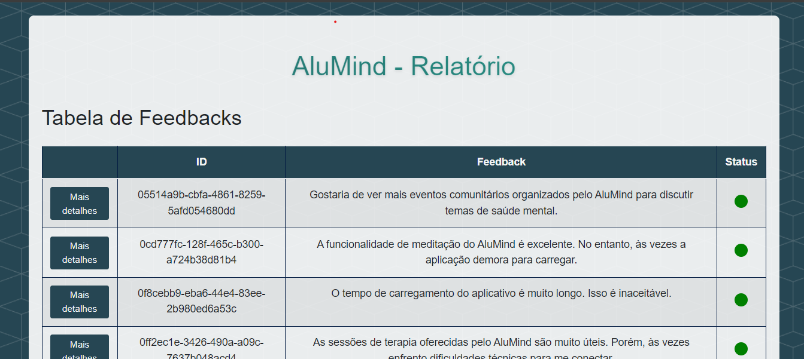
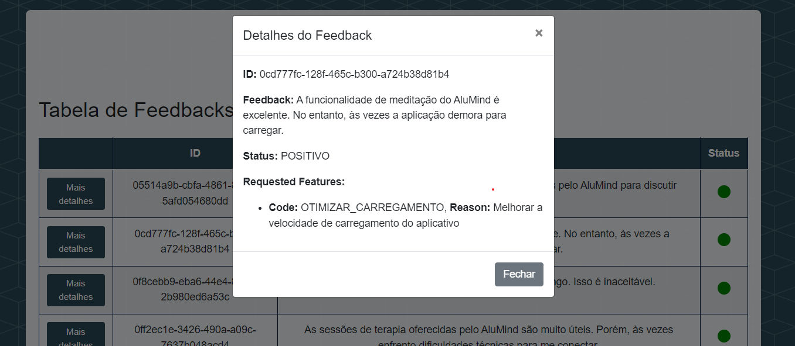
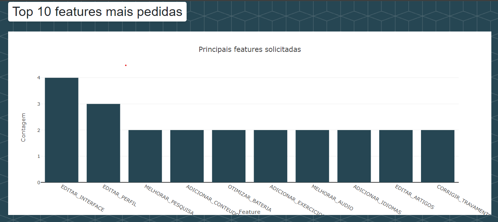
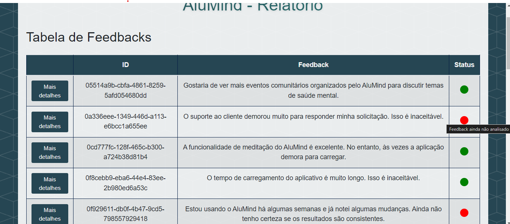

# Feedback Analysis System - AluMind

<h1 align="center">
    
</h1>

<h4 align="center"> 
	🚧 Feedback Analysis System - AluMind 🚧
</h4>

<p align="center">
	
</p>

</p>

<a name="ancora"></a>
# Seções
- [Sobre](#-sobre-o-projeto)
- [Funcionalidades](#-funcionalidades)
- [Requisitos técnicos](#-requisitos-tecnicos)
- [Layout](#-layout)
- [Como executar](#-como-executar-o-projeto)
- [Tecnologias](#-tecnologias)
- [Melhorias Futuras](#-melhorias)
- [Como contribuir para o projeto](#-contribuir)
- [Autor](#-autor)


<a id="-sobre-o-projeto"></a>
## 💻 Sobre o projeto

AluMind Feedback Analysis é uma aplicação web desenvolvida para a análise e visualização de feedbacks dos usuários da plataforma AluMind, que oferece meditações guiadas, sessões de terapia e conteúdos educativos sobre saúde mental. A aplicação tem como objetivo principal processar e exibir feedbacks dos usuários, classificar a análise de sentimentos e gerar relatórios semanais. No intuito de cumprir seus requisitos funcionais, as principais tecnologias utilizadas foram: Python, Flask, MySQL, Azure, Google Gemini, LLMs, Redis, Langchain, HTML/CSS/JS e Git. 

Acesse via Browser | Deploy: Ainda não disponível, há um issue encontrado no Vercel ao instalar a biblioteca langchain [Acesse o issue aqui](https://github.com/orgs/vercel/discussions/4354)

---

<a id="-funcionalidades"></a>
## ⚙️ Funcionalidades

- Classificação Feedbacks:
    - Receber um feedback armazenado no banco para processamento;
    - Classificar o feedback em POSITIVO, NEGATIVO ou INCONCLUSIVO;
    - Elencar as features sugeridas pelo feedback, se houver;
    - Armazenar uma razão para qual aquela feature sugerida é relevante;
    - Retornar a análise de determinado feedback.

- Relatório em página web:
    - Exibição de todos os feedbacks armazenados no banco de dados em forma de tabela;
    - Classificar o status de cada feedback de acordo com o processamento feito ou não dele;
    - Exibir um gráfico do tipo pie para evidenciar as porcentagens de tipos de feedbacks analisados;
    - Exibir um histograma para demonstrar as 10 features mais solicitadas.

- Resumo Semanal:
    - Gerar uma coleção de informações contendo as %s de feedbacks positivos e negativos;
    - Gerar uma coleção de informações contendo as 5 features mais pedidas e suas razões;
    - Agendar uma rotina semanal às 17h de toda sexta-feira para enviar um email com o resumo para os stakeholders.

- Página de simulação:
    - Enviar a carga da tabela "feedbacks" para a aplicação, simulando a atividade de outra equipe;
    - Enviar o email de relatório semanal forçadamente no intuito de testar a funcionalidade.

---

<a id="-requisitos-tecnicos"></a>
### ⚙️ Levantamento de Requisitos e discussões
Os requisitos desse projeto foram levantados e dividios em artefatos. Como parte do processo de entendimento do case técnico, uma discussão a respeito das tomadas de decisões feitas para este experimento foram feitas no documento. Além disso, também há um esboço da modelagem do banco de dados: [LINK DO ARQUIVO]()


<a id="-layout"></a>
## 🎨 Layout

### Web /report

<p align="center" style="display: grid; grid-template-columns: repeat(2, 1fr); justify-items: center; gap: 10px;">
  
  
  
  
  <div style="grid-column: span 2; display: flex; justify-content: center;">
    
  </div>
</p>

---

<a id="-como-executar-o-projeto"></a>
## 🛣️ Como executar o projeto

### Pré-requisitos

Antes de começar, você vai precisar ter instalado em sua máquina as seguintes ferramentas:
[Git](https://git-scm.com), [Python 3.11+](https://www.python.org/downloads/), [MySQL](https://dev.mysql.com/downloads/installer/) e [MySQL Workbench](https://dev.mysql.com/downloads/workbench/). 
Além disso, é bom ter um editor para trabalhar com o código como [VSCode](https://code.visualstudio.com/)


#### 🎲 Rodando o projeto localmente

```bash
# Clone este repositório
$ git clone git@github.com:lucasboot/feedback-analysis-alumind.git

# Acesse a pasta do projeto no terminal/cmd
$ cd feedback-analysis-alumind

# Uso de environment isolado (Opcional)
$  python -m venv myenv 
## Windows
$  myenv\Scripts\activate 
## MacOS e Linux
$ source myenv/bin/activate


# Instale as dependências
$  pip install -r .\requirements.txt   

# Execute a aplicação local
$ python app.py

# O projeto executará na porta: 5000 - acesse http://127.0.0.1:5000/
```

#### 🎒 Instruções para uso
- ✅ Crie um arquivo .env na raíz do projeto e adicione:
    - MYSQL_USER=usuario_banco_dados;
    - MYSQL_PASSWORD=senha_banco_dados
    - MYSQL_HOST=host_banco_dados
    - MYSQL_DB=alumind_db
    - GOOGLE_AI_API_KEY=sua_chave_da_google_api
    - 🔴 Você pode criar uma chave da Google API gratuitamente [AQUI](https://aistudio.google.com/app/apikey)
    - 🔴 Se você ainda lê este trecho, eu deixei os valores atuais desse arquivo para um banco MySQL hospedado na Azure no final deste README, porém é necessário adicionar o seu IP na lista de permissões do firewall, sinta-se livre para me enviar um email com seu IP para que eu possa adicionar.

- ✅ No MySQL Workbench, execute o script de [criação do banco](https://github.com/lucasboot/feedback-analysis-alumind/blob/main/mysql_db/creation.sql)
- ✅ Com a aplicação em execução, alimente o banco de dados pela rota *POST* http://127.0.0.1:5000/feedbacks_ingestion  adicionando um JSON no body em formato de lista, como no arquivo: [feedbacks para inserção](https://github.com/lucasboot/feedback-analysis-alumind/blob/main/mysql_db/feedbacks.json)
- ✅ Agora que os feedbacks estão armazenados no banco, para enviá-los para a API analisar, basta acessar a página (http://127.0.0.1:5000/simulation), que só existe no escopo desse protótipo para simular o envio deles por outra equipe de desenvolvimento e clique no botão "Enviar feedbacks" e aguarde o processamento de todos (Essa etapa pode demorar um tempo considerável, dependendo da quantidade de feedbacks adicionados na /feedbacks_ingestion)
- ✅ Após finalizar a etapa anterior, já é possível acessar a página de report (http://127.0.0.1:5000/report), caso você tente acessar antes de adicionar feedbacks/criar o banco, uma página sinalizando isso é exibida no lugar
- ✅ A aplicação está configurada para enviar o relatório semanal de feedbacks toda sexta-feira às 17h, mas você pode testar a qualidade do email gerado (que também é gerado com LLMs!) substituindo no [ARQUIVO](https://github.com/lucasboot/feedback-analysis-alumind/blob/main/app/__init__.py) o parâmetro schedule por 'schedule': crontab(minute='*') para que o email seja enviado a cada 1 minuto. Não esqueça de adicionar o seu email como destinatário para poder recebê-lo na lista "to_emails" do [ARQUIVO](https://github.com/lucasboot/feedback-analysis-alumind/blob/main/app/utils/send_weekly_report.py)
- 🔴 O Redis Cache utilizado para administrar o uso da biblioteca Celery foi criado e está com sua configuração inserida no próprio código, caso o seu uso esteja indisponível, crie um gratuitamente [Link](https://app.redislabs.com/) e edite as variáveis dele no [ARQUIVO](https://github.com/lucasboot/feedback-analysis-alumind/blob/main/app/config.py)


<a id="-tecnologias"></a>
## 🛠 Tecnologias E Versões

As seguintes ferramentas/bibliotecas foram usadas na construção do projeto:

#### **Desenvolvimento** 
 -   Python 3.11.1
 -   MySQL 8.0.21
 -   Flask 2.3.1
 -   langchain-google-genai 1.0.7
 -   Redis Stack 7.2.3
 -   Git/Github

#### []()**Utilitários**

-   Esboço do banco de dados:  **[Draw.io](https://www.drawio.com/)**  
-   Teste de API:  **[Thunder Client](https://www.thunderclient.com/)**
-   Editor:  **[Visual Studio Code](https://code.visualstudio.com/)** 
-   Convenção de commits utilizada:  **[Free Code Camp Commits](https://www.freecodecamp.org/news/how-to-write-better-git-commit-messages/)** 


<a id="-melhorias"></a>
## 🚀 Melhorias Futuras

1. Faça um **fork** do projeto.
2. Crie uma nova branch com as suas alterações: `git checkout -b my-feature`
3. Salve as alterações e crie uma mensagem de commit contando o que você fez: `git commit -m "feature: My new feature"`
4. Envie as suas alterações: `git push origin my-feature`


---
<a id="-contribuir"></a>
## 💪 Como contribuir para o projeto

1. Faça um **fork** do projeto.
2. Crie uma nova branch com as suas alterações: `git checkout -b my-feature`
3. Salve as alterações e crie uma mensagem de commit contando o que você fez: `git commit -m "feature: My new feature"`
4. Envie as suas alterações: `git push origin my-feature`


---

<a id="-autor"></a>
## 🧙‍♂️ <h2 id="#autor">Autor</h2>

Feito por Lucas Alves👋🏽 [Entre em contato!](https://www.linkedin.com/in/lucasfva/)

---


